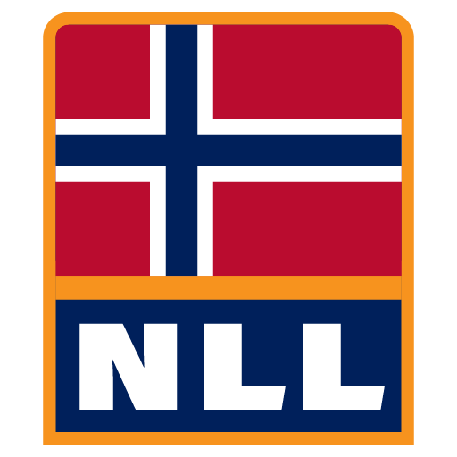

# NLL Website

 Norwegian Language Learning (NLL) is a community of people who support each other in learning and helping others learn the Norwegian language. We operate a [Discord server](https://discord.gg/mBsKjx7) that welcomes everyone, whether Norwegian is their native language or they are just beginning their language learning journey.

This repository contains the source code that powers the NLL website.

## Contributing

> [!IMPORTANT]
> If you are not familiar with Git, GitHub, or the command line, you can still contribute to the website. You can contribute using the Decap CMS (formerly Netlify CMS) interface at [https://nllcommunity.github.io/admin](https://nllcommunity.github.io/admin).
>
> If your primary purpose is to contribute content, you do not need to follow the instructions in this section. You can simply use the Decap CMS interface to contribute content.

Make sure you have [Node.js](https://nodejs.org/en/) and [Yarn](https://yarnpkg.com/) installed.

> [!TIP]
> It is recommended to use [Volta](https://volta.sh/) to manage Node.js versions. If Volta is installed, you do not need to do anything. When you run any commands in this repository, Volta will automatically install and install the correct versions of both Node.js and Yarn.

1. Clone the repository
2. Run `yarn` to install dependencies
3. Run `yarn start` to start the development server
4. Open [http://localhost:3120](http://localhost:3120) in your browser
5. Make changes to the code and see the changes live in your browser
6. Commit your changes and [open a pull request](https://github.com/nllcommunity/nllcommunity.github.io/pulls)

```sh
git clone https://github.com/nllcommunity/nllcommunity.github.io.git
cd nllcommunity.github.io

yarn
yarn start
```

## Licence

This project is licensed under the [MIT License](LICENSE).
